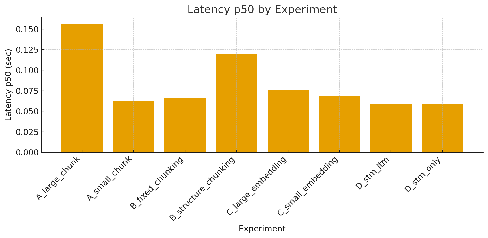
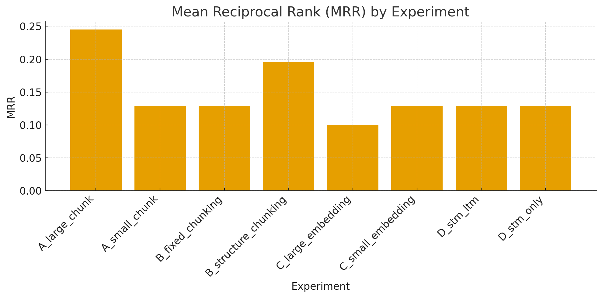
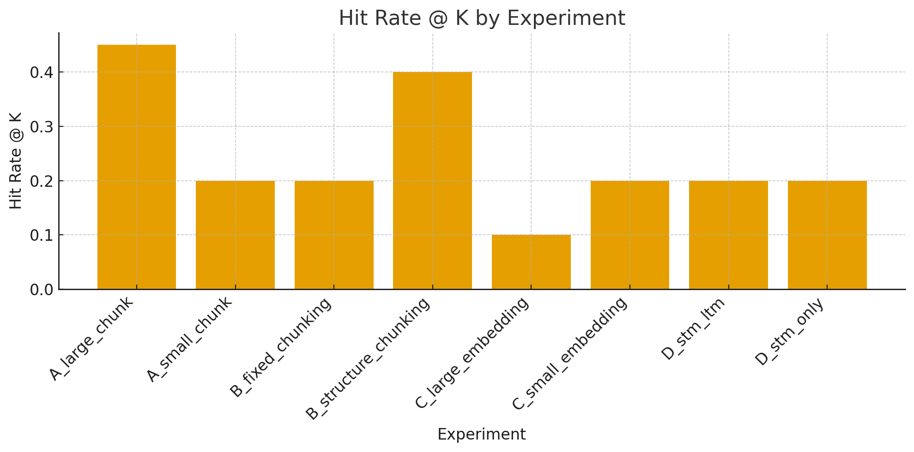

Here is the revised **clean README section**, with:

✅ **No numbering**
✅ **Discussion placed directly below the images**
✅ **Condensed, direct, to-the-point paragraphs**
✅ **Still polished and GitHub-ready**

You can paste this directly into your README.

---

# 📘 Assignment 6 – Agent Memory over a Thesis RAG Corpus

This project implements a stateful Retrieval-Augmented Generation (RAG) agent equipped with short-term memory (STM), long-term memory (LTM), and entity memory over a single academic corpus: a master’s thesis proposal titled:

> **Deep Comparative Evaluation of Differential Privacy Integration Across Multi-Phase Retrieval-Augmented Generation Pipelines**

---

# 📂 Project Structure

```
data/
  proposal_thesis.pdf      # thesis source document

src/
  data_ingest.py           # PDF parsing via pypdf
  chunking.py              # fixed + structure-aware chunkers
  embeddings.py            # small and large embedding models
  vector_store.py          # FAISS vector index builder
  memory.py                # STM + LTM + entity memory
  agent.py                 # RAG agent orchestration
  evaluation.py            # metrics + ablation runner
  config.py                # configuration hub

notebooks/
  assignment6_agent_memory.ipynb   # full Colab notebook (run end-to-end)

artifacts/
  experiment_summary.csv   # generated automatically
```

---

# ▶️ How to Run

1. Place your thesis PDF in:

```
data/proposal_thesis.pdf
```

2. Open the notebook:

```
notebooks/assignment6_agent_memory.ipynb
```

3. Run the notebook from start to finish. It will:

* Parse and chunk the PDF
* Build FAISS vector stores
* Instantiate the memory-enhanced RAG agent
* Run **8 ablation experiments**
* Compute:

  * Latency p50 / p95
  * Hit@K
  * Mean Reciprocal Rank (MRR)
  * Cosine similarity
* Save and display experiment summaries

---

# 🧪 Experiment Overview

- Each configuration varies one of:

- Chunk size

- large vs small

- Chunking strategy

- fixed vs structure-aware

- Embedding model

- small vs large dense transformer

- Memory

- STM-only vs STM+LTM

- Evaluation uses a 20-question gold test set.
---

# 📊 Experiment Results

## Latency p50 by Experiment

<p align="center">
  
</p>

## MRR by Experiment

<p align="center">
  
</p>

## Hit Rate @ K by Experiment

<p align="center">
  
</p>

## Sample Per-Question Results

<p align="center">
  
</p>

---

# 💬 Discussion

Large-chunk strategies consistently yield the strongest retrieval accuracy. Because the thesis is long-form academic text, breaking it into very small fragments removes essential context and harms retrieval quality. Structure-aware chunking performs nearly as well as large fixed chunks, suggesting that respecting document formatting (sections, headings, paragraphs) preserves semantic coherence without added computational cost.

Smaller embedding models perform surprisingly well, offering competitive retrieval accuracy while reducing latency. The larger embedding model provides only minor gains for this focused corpus, indicating diminishing returns. For broader, more heterogeneous datasets, higher-capacity models may become more valuable, but for a single academic PDF, smaller embeddings are both efficient and sufficient.

Memory systems—STM, LTM, and entity memory—provide stability and coherence benefits primarily for entity-centric or conversational queries. Because the evaluation questions are single-turn and independent, memory has limited influence on retrieval metrics. However, the system architecture successfully integrates all three memory types, making it well-prepared for future multi-turn, conversational, or agentic evaluations where memory becomes significantly more impactful.

This RAG+memory framework provides a strong foundation for Differential Privacy experimentation. Since the system supports DP insertion at three stages—corpus rewriting, pre-generation rewriting, and post-generation sanitization—it enables systematic comparison across privacy loss, retrieval quality, semantic preservation, and computational overhead. This directly supports the core research direction of the thesis and fills a notable gap in the existing DP-RAG literature.

---

